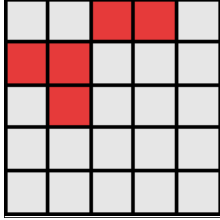
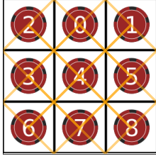
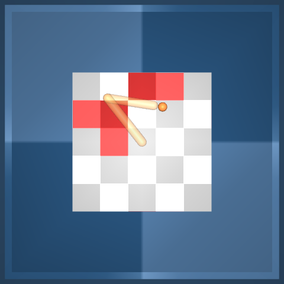
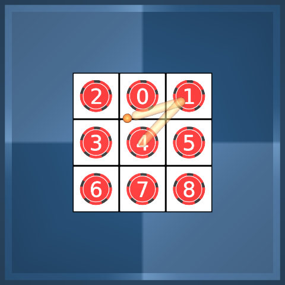
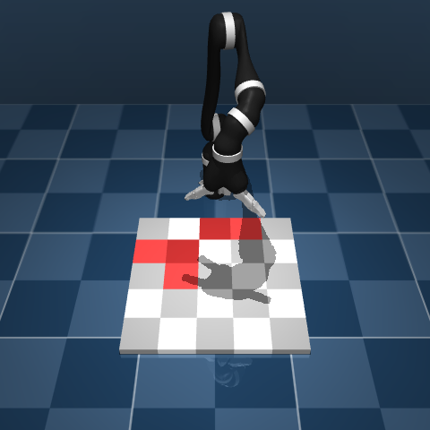
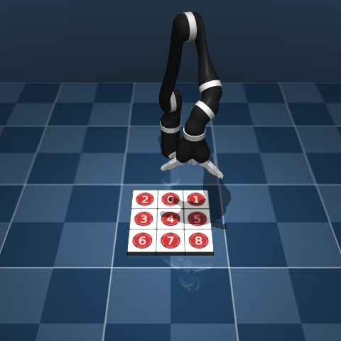

# Code for physically embedded single-player board game environments (used to evaluate the SEADS agent)

The environments in this repository were presented, alongside the hierarchical reinforcement learning agent SEADS,
in the publication:

Achterhold, Jan and Krimmel, Markus and Stueckler, Joerg: \
**Learning Temporally Extended Skills in Continuous Domains as Symbolic Actions for Planning**\
6th Annual Conference on Robot Learning 2022 (CoRL 2022)

Project page: https://seads.is.tue.mpg.de/ \
Full paper: https://openreview.net/forum?id=t-IO7wCaNgH

If you use the code, data or models provided in this repository for your research, please cite our paper as:
```
@inproceedings{
    achterhold2022learning,
    title={Learning Temporally Extended Skills in Continuous Domains as Symbolic Actions for Planning},
    author={Jan Achterhold and Markus Krimmel and Joerg Stueckler},
    booktitle={6th Annual Conference on Robot Learning (CoRL)},
    year={2022},
    url={https://openreview.net/forum?id=t-IO7wCaNgH}
}
```

**Please find the implementation of the SEADS agent at https://github.com/EmbodiedVision/seads-agent**.


| | | | | | |
| --- | --- | --- | --- | --- | --- |
|  |  |  |  |  |  |  |
| `LightsOutCursorEnv` | `TileSwapCursorEnv` | `LightsOutReacherEnv` | `TileSwapReacherEnv` | `LightsOutJacoEnv` | `TileSwapJacoEnv` |

This directory contains physically embedded single-player board game environments.
The idea of embedding board games into physical manipulation scenarios was introduced
by Mirza et al., 2020 [1]. We propose embedded single-player board games.


## Installation
1) Install `git-lfs`
```
sudo apt install git-lfs
```

2) Clone repository
```
git clone https://github.com/EmbodiedVision/seads-environments
```

3) Update `wheel/pip/setuptools`
```
pip install -U pip setuptools wheel
```

4) Install package
```
cd seads-environments; python check_hdf.py; pip install .
```

5) Set environment variables
```
export LD_LIBRARY_PATH=$LD_LIBRARY_PATH:<MUJOCO_200_DIR>/bin/
export MJKEY_PATH=<PATH_TO_MJKEY.TXT>
export MJLIB_PATH=<MUJOCO_200_DIR>/bin/libmujoco200.so
export MUJOCO_GL="osmesa"
```

6) Run tests to check installation
```
python -I -m unittest seads_envs/test_hybrid.py
```

## Usage
We provide two board games (`LightsOut`, `TileSwap`) with three different physical
manipulation embeddings (`Cursor`, `Reacher`, `Jaco`).
You can directly instantiate the `LightsOutCursor`, `TileSwapCursor`,
`LightsOutReacher`, `TileSwapReacher`, `LightsOutJaco`, `TileSwapJaco`
environments via the respective classes in `seads_envs.hybrid.cursor`, `seads_envs.hybrid.reacher`, `seads_envs.hybrid.jaco`.

### Common parameters
All environments share the following parameters:

| Parameter name | Description |
|---|---|
|`reset_split` | Split of the initial board configuration (`train` or `test`). |
|`max_solution_depth` | Maximum solution depth of initial board configuration (number of steps required to solve the board). |
| `board_size` | (One-sided) board size, e.g. 5 for `LightsOut` and 3 for `TileSwap`. |
| `random_solution_depth` | Randomly sample actual solution depth from {1, ..., `max_solution_depth`}. If `False`, always use `max_solution_depth` (default).|
| `done_if_solved` | Set `done` flag only when board is solved; if `False`, set `done` flag whenever the board state has changed (default). If you want to train a non-hierachical agent, set `done_if_solved=True`.|

### Distinct parameters
Some environments possess distinct parameters, the most important ones
are explained below. For a exhaustive description, see the docstrings
of the respective environments.

| Parameter name (environments)| Description |
|---|---|
|`mixed_action_space` (`*Cursor`, `*Reacher`) | If `True`, use a binary action for indicating that the field below the end effector is pushed. If `False`, use a continuous variable and evaluate if it exceeds a threshold (default). |
| `toggle_by_halffield` (`LightsOutCursor`) | If `True`, fields can only be switched *on* when pushing on the upper half, and only be switched off when pushing on the lower half. Default: `False`. |
| `rendering_enabled` (`*Jaco`) | If `False`, environment rendering is disabled. This saves computation, as otherwise during each environment step, a rendering is prepared for a potential call of `render`. Default: `False`. |
| `stairs` (`LightsOutJaco`) | If `True`, elevate the `LightsOut` fields (`LightsOut3DJaco` environment). |

### Alternative instantiation
You may also instantiate the environments via `seads_envs.load_env`. Here, you
need to pass the environment name, following the scheme `<board_game><manipulator>BsX`, e.g.
`LightsOutReacherBs5`, where the last digit indicates the board size. In our
experiments we only use a boardsize of 5 for all `LightsOut` environments
and a boardsize of 3 for all `TileSwap` environments. Optionally,
you can pass a time limit for the environments (`time_limit`) and
augment the observations by a normalized remaining time (`ext_timelimit_obs`).

### Solution depth and train/test split

By `solution depth` we refer to  the number of steps
required to bring a particular board into its target configuration (all lights of in `LightsOut`,
ordered tiles in `TileSwap`). To compute board configurations for particular solution depths,
we use a reversed breadth-first search (starting from the target board configuration), see
[seads_envs/board_games/bfs_reverse.py](seads_envs/board_games/bfs_reverse.py).
All boards are classified into `train` and `test` splits using a hash function.
The actual number of boards of particular solution depth per split can be displayed with
[seads_envs/board_games/dataset_size_analyze.py](seads_envs/board_games/dataset_size_analyze.py).


## Visualization
For a visualization of the proposed environments, see the notebooks in the
[visualization](visualization) subdirectory. The notebook
at [visualization/embedded_environments.ipynb](visualization/embedded_environments.ipynb)
exemplarily instantiates all embedded environments.


## License
See [LICENSE](LICENSE) and [NOTICE](NOTICE).

For license information on 3rd-party software we use in this project, see [NOTICE](NOTICE).
To comply with the Apache License, Version 2.0, any Derivative Works that You distribute must include a readable copy of the attribution notices contained within the NOTICE file (see [LICENSE](LICENSE)).

## References
[1] M. Mirza, A. Jaegle, J. J. Hunt, A. Guez, S. Tunyasuvunakool, A. Muldal, T. Weber, P. Karkus,
S. Racanière, L. Buesing, T. P. Lillicrap, and N. Heess. “Physically Embedded Planning
Problems: New Challenges for Reinforcement Learning”. In: CoRR abs/2009.05524 (2020).
arXiv: 2009.05524. URL: https://arxiv.org/abs/2009.05524.
